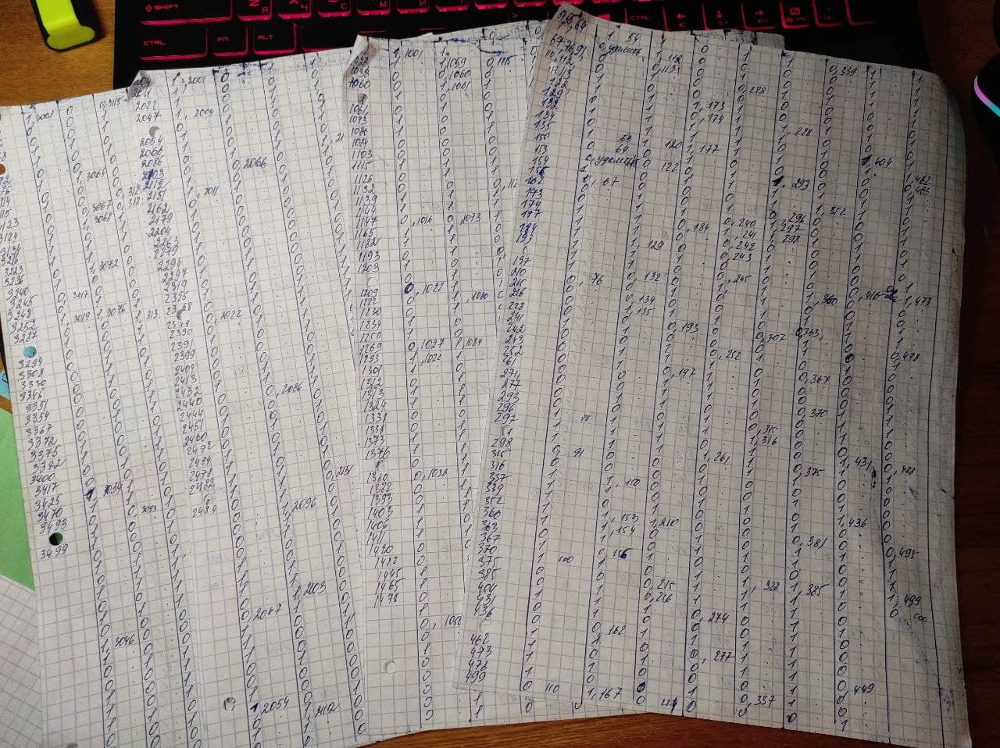
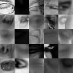
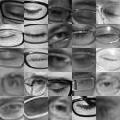
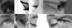
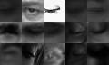
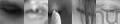
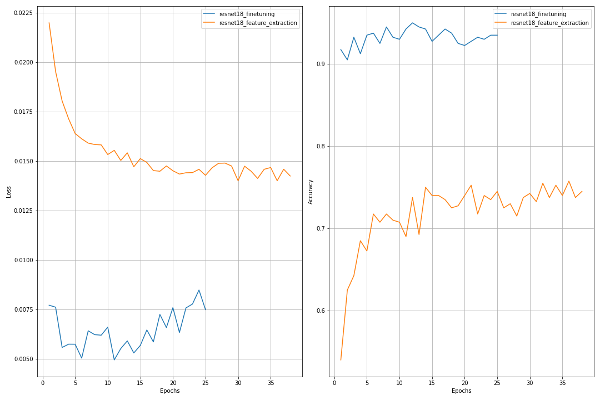
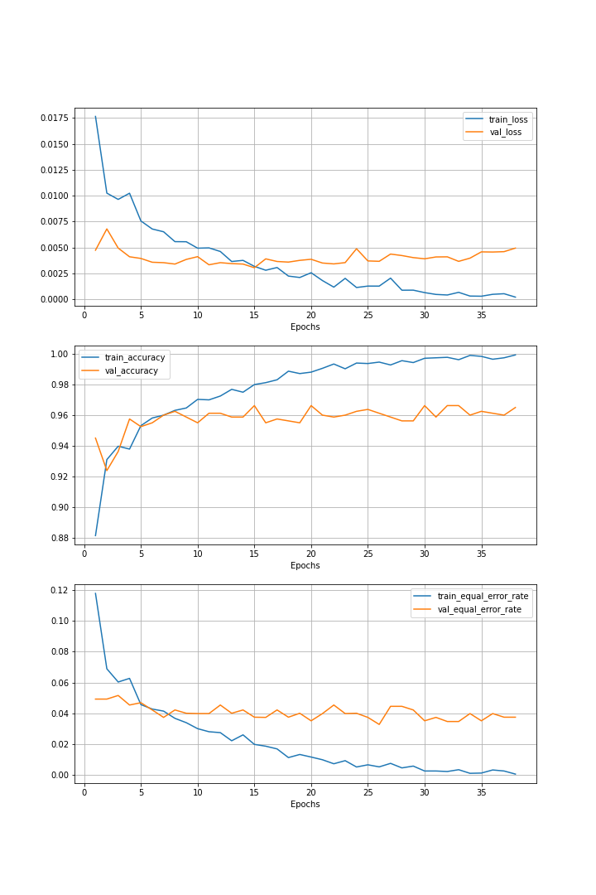

# Задача классификации открытых/закрытых глаз


## Оглавление
- [Постановка задачи](#Постановка-задачи)
  - [Data Labeling](#Data-Labeling)
  - [Примеры картинок](#Примеры-картинок)
    - [Плохие примеры](#Плохие-примеры)
    - [Очки](#Очки)
    - [Нестандартный ракурс](#Нестандартный-ракурс)
    - [Инверсия цвета или тёмная картинка](#Инверсия-цвета-или-тёмная-картинка)
    - [Другое - "сборная солянка"](#Другие-примеры)
- [Выбор модели](#Выбор-модели)
- [Выбор метода обучения модели](#Выбор-метода-обучения-модели)
- [Обучение модели](#Обучение-модели)


## Постановка задачи
Дана обучающая выборка из 4000 картинок, каждая размером (24, 24).
Необходимо реализовать классификатор, который возвращает вероятность того,
что на данной картинке глаз(а) открыт(ы).

### Data Labeling
Так как данные не размечены, то необходимо их разметить ...
Тут всё одновременно просто и сложно ... берёшь да размечаешь...

По факту процесс разметки занял 4 дня по 1000 картинок каждый день, дабы "не замылить"
глаза в процессе разметки данных

А вот и конечный результат ... (p.s. c другой стороны тоже всё в ноликах и единичках)

Вся разметка была вручную перенесена в [img_name_target.xlsx](img_name_target.xlsx)

### Примеры картинок
В процессе разметки данных производилась формальная(на основе моего мнения) классификация
картинок на несколько категорий, которые представлены ниже с соответствующими примерами.

Более детально процесс создания коллажей [см. в data_categories.ipynb](for_readme/data_categories.ipynb)
#### Плохие примеры
- Либо слишком тёмная картинка, либо просто чёрная
- Очень размытые картинки
- Паттерны, которые совсем или слабо похожи на глаза



#### Очки
- Большое кол-во примеров с очками в разных положениях
- Линзы очков искажают изображение глаз(а)



#### Нестандартный ракурс
- Взгляд вверх или в сторону 
- На картинке лишь край глаза(или его малая часть)



#### Инверсия цвета или тёмная картинка
- Многие примеры сильно затемнены или размыты
- Есть и наоборот примеры, как будто производилась инверсия цвета



#### Другие примеры
- Палец на глазу
- Волосы
- Эмблема названия сайта
- Засвет, блик солнца 
- Тушь ны глазу(из-за чего сильно затемнена область рядом с глазом) 




## Выбор модели
Так как данных относительно не много, чтобы с нуля обучать модель,
то были выбраны уже предобученные модели из [torchvision.models](https://pytorch.org/vision/stable/models.html)

Из всех моделей, которые рассматривались(ResNet, VGG, AlexNet, Inception)
подошла лишь архитектура ResNet, т.к. размеры входящих картинок (24, 24)
много меньше рекомендованных (224, 224)


## Выбор метода обучения модели
Предобученную модель можно дообучать разными способами: 
finetuning, feature extraction. 
Поэтому были проведены экспериметны для выявления наилучшего
метода обучения модели([более детально см. choose_method.ipynb](choose_method.ipynb))

Сравнение двух способов обучения модели показало, что finetuning 
даёт лучшее качество модели, поэтому будем обучать модель
данным способом.

Пример графиков зависимоти loss/accuracy по эпохам от метода обучения модели.



## Обучение модели
Весь процесс обучения модели [см. в train_model.ipynb](train_model.ipynb).
Веса модели сохранялиь по лучшему loss на валидации.

Полученные результаты представлены на графиках ниже(loss, accuracy, eer соответственно)



## Выводы
Как можно заметить, в процессе обучения модель переобучалась на train данных,
поэтому веса модели сохранялись по лучшей валидационной эпохе.

Также, как было упомянуто ранее, среди данных имеются "мусорные" картинки,
в которых сложно распознать паттерн глаза, но удалять их я не стал, дабы попытаться
сделать относильно устойчивой к тамим ситуациям.

На всём датасете удалось добиться eer ~ 0.04 на валидационной выборке,
и ошибка падает с увеличением данных, которые используются для обучения
модели.


#### Используемые источники
- [AboutFAR_FRR_EER.pdf](other_resources/AboutFAR_FRR_EER.pdf)


## Использование полученных результатов
Предполагается, что клонирование репо происходит в виртуальную среду
- Клонирование репозитория
```
git clone https://github.com/kirill-ionkin/Test_tasks.git
```
- Переход в нужную директорию
```
cd Test_tasks\VisionLabs
```
- Установка соответствующих зависимостей(библиотек)
```
pip install -r requirements.txt
```
- Использование классификатора
```
python classificator.py "abs_path_to_img"
```